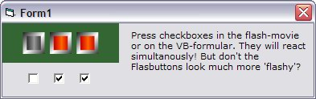



## Flash\<=\>VB Example with 3 CheckBoxes

### Description

VB might be one of the greatest tools for fast programming but - the user interface! isn't it at least a little clumpsy and boring? But there ist help, called macromedia flash! I think much mor coders would like to use flash-movies for the user-end but ... isn't it a pain to handle the inteface? NO IT ISN'T ans it's worth to become familiar to it!
 
### More Info
 
you need of course the actual flash.ocx to get the movie run! look for the newest flash-playler on macromedia.com and install the FREE player. the OCX will be there...

of course, one must dive a little into the action-script language of flash, but it's rather close to VB (except little but disturbing diffeences like i.e. the double == for logical comparisons). Again: it's worth to spend some time on it!

             |
---                |---
**Submitted On**   |2003-10-28 16:17:02
**By**             |[Peter\-W\. Fischer](https://github.com/Planet-Source-Code/PSCIndex/blob/master/ByAuthor/peter-w-fischer.md)
**Level**          |Intermediate
**User Rating**    |4.0 (16 globes from 4 users)
**Compatibility**  |VB 6\.0
**Category**       |[Miscellaneous](https://github.com/Planet-Source-Code/PSCIndex/blob/master/ByCategory/miscellaneous__1-1.md)
**World**          |[Visual Basic](https://github.com/Planet-Source-Code/PSCIndex/blob/master/ByWorld/visual-basic.md)
**Archive File**   |[Flash\_=\_VB16641810282003\.zip](https://github.com/Planet-Source-Code/peter-w-fischer-flash-vb-example-with-3-checkboxes__1-49491/archive/master.zip)

